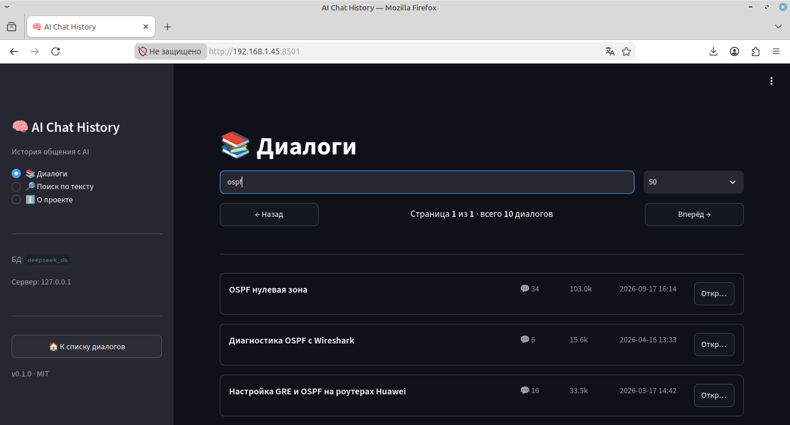
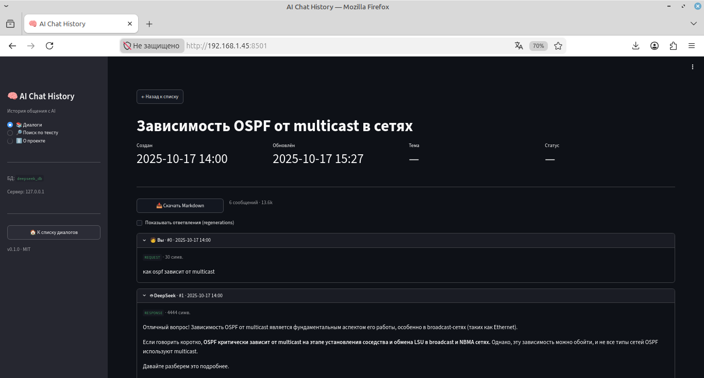
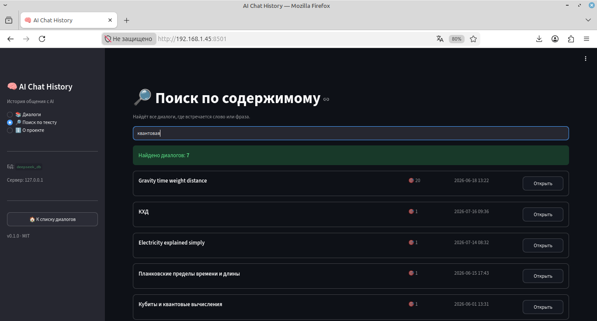
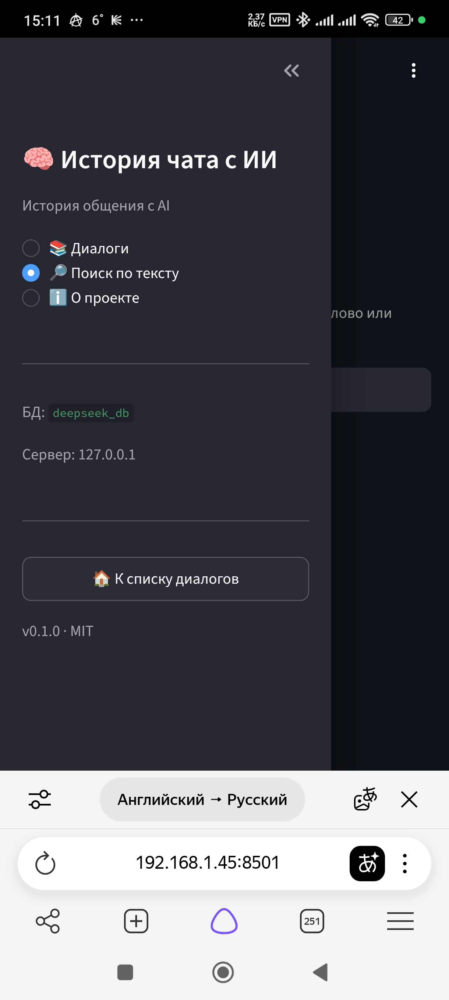

# AIChat History

Инструмент для структурирования, хранения и просмотра истории общения с AI-чатами (DeepSeek, в будущем — другие).

Превращает экспорт чатов в **персональную базу знаний**: поиск по содержимому, просмотр диалогов целиком, экспорт в Markdown, а в планах — LLM-классификация и RAG-поиск по своей истории.

## Возможности

- 📥 **Парсинг** JSON-экспорта DeepSeek с полным сохранением структуры диалогов
- 🗄 **PostgreSQL** для хранения — диалоги, сообщения, fragments (запросы, ответы, thinking, поиск, файлы)
- 🔎 **Поиск** по заголовкам и по содержимому всех сообщений
- 📖 **Просмотр** диалогов целиком с ролями, таймстемпами, метриками
- 📥 **Экспорт** отдельного диалога в Markdown
- 🌐 **Веб-интерфейс** на Streamlit — доступен с любого устройства в сети
- ⚙️ **Работает как сервис** — systemd-юнит, автозапуск, автоперезапуск при падении

## Скриншоты

### Список диалогов

### Просмотр диалога

### Поиск по содержимому

### Мобильный доступ

## Стек

- **PostgreSQL 15** — хранение данных
- **Python 3.11+** — парсер, загрузчик, UI
- **psycopg 3** — драйвер Postgres
- **Streamlit** — веб-интерфейс
- **systemd** — запуск UI как сервиса

## Архитектура
┌──────────────────┐        ┌─────────────────────────┐
│ Браузер          │ ─────► │ Streamlit (порт 8501)   │
│ (бук, телефон)   │        │ app.py + app/*          │
└──────────────────┘        └───────────┬─────────────┘
                                        │ psycopg3
                                        ▼
                            ┌─────────────────────────┐
                            │ PostgreSQL 15           │
                            │ ├── conversations       │
                            │ ├── messages            │
                            │ └── fragments           │
                            └─────────────────────────┘
                                      ▲
                                      │ load.py
                                      │
                            ┌─────────────────────────┐
                            │ JSON-экспорт DeepSeek   │
                            │ + parse.py              │
                            └─────────────────────────┘
## Структура проекта

AIChat-history/
├── app/ # Streamlit-модули
│ ├── db.py # подключение к Postgres
│ ├── queries.py # SQL-запросы
│ └── utils.py # форматирование, экспорт
├── app.py # точка входа Streamlit
├── data/
│ └── sample_export.json # пример структуры экспорта (обезличенный)
├── deploy/
│ └── aichat-ui.service # systemd-юнит
├── docs/
│ └── screenshots/ # скриншоты для README
├── scripts/
│ ├── parse.py # парсер JSON → плоские структуры
│ ├── load.py # загрузка в Postgres
│ ├── schema.sql # схема БД
│ └── test_conn.py # проверка подключения
├── .env.example # шаблон переменных окружения
├── .streamlit/config.toml # конфиг Streamlit
├── requirements.txt
└── README.md

## Быстрый старт

### 1. Требования

- PostgreSQL 15+
- Python 3.11+

### 2. Клонирование и настройка

git clone git@github.com:dmsrgm-creator/AIChat-history.git
cd AIChat-history

python3 -m venv .venv
source .venv/bin/activate
pip install -r requirements.txt

cp .env.example .env
- отредактируйте .env — впишите свои параметры подключения к Postgres

### 3. Подготовка БД

CREATE ROLE aichat WITH LOGIN PASSWORD 'your_password';
CREATE DATABASE aichat_db OWNER aichat;

psql -h 127.0.0.1 -U aichat -d aichat_db -f scripts/schema.sql

### 4. Загрузка данных

- Проверка без записи в БД
python scripts/parse.py

- Загрузка (идемпотентная — дубликаты пропускаются)
python scripts/load.py

### 5. Запуск UI

streamlit run app.py

-Откройте http://localhost:8501

### 6. Запуск как сервис (Linux)

sudo cp deploy/aichat-ui.service /etc/systemd/system/
sudo systemctl daemon-reload
sudo systemctl enable --now aichat-ui
sudo systemctl status aichat-ui

### 7. Формат данных

Проект рассчитан на официальный экспорт DeepSeek — JSON-массив диалогов, где каждый диалог содержит дерево mapping с узлами-сообщениями и fragments внутри (типы: REQUEST, RESPONSE, THINK, SEARCH, FILE, TOOL_SEARCH, TOOL_OPEN).

Пример структуры — в data/sample_export.json.

##  Roadmap

    ☑

    Парсер экспорта DeepSeek
    ☑

    Схема БД с нормализацией
    ☑

    Загрузчик с идемпотентностью
    ☑

    Веб-интерфейс (список, поиск, просмотр, экспорт)
    ☑

    systemd-сервис для 24/7
    □

    LLM-классификация диалогов (тема, резюме, статус, результат)
    □

    Milestones — автоматическое выделение решений, тупиков, поворотов
    □

    Полнотекстовый поиск с русской морфологией (tsvector)
    □

    RAG: вопросы по своей истории (pgvector + эмбеддинги)
    □

    Поддержка других AI-чатов (ChatGPT, Claude, Gemini)

## Лицензия

MIT

